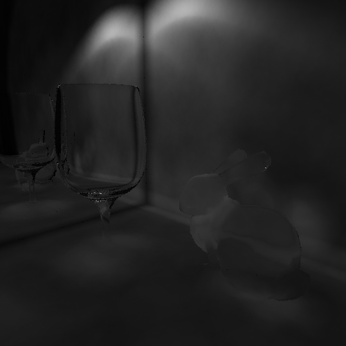
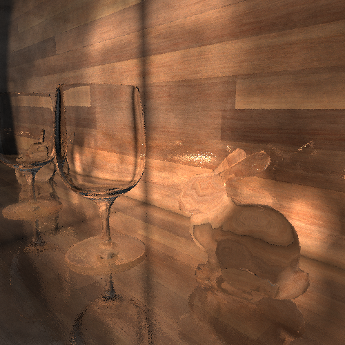
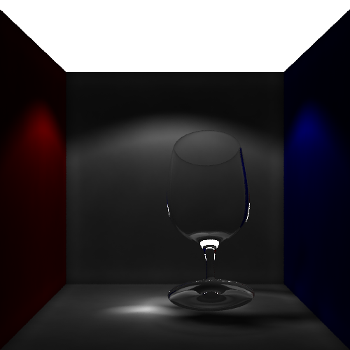
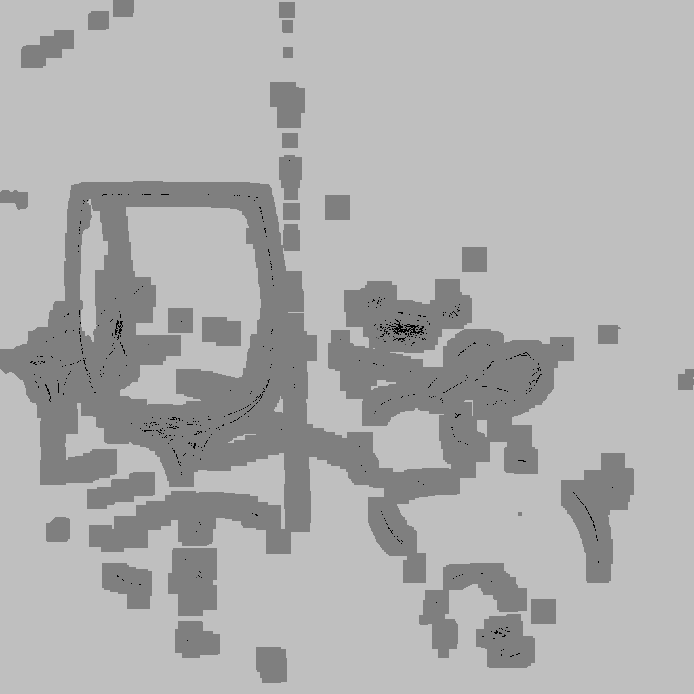
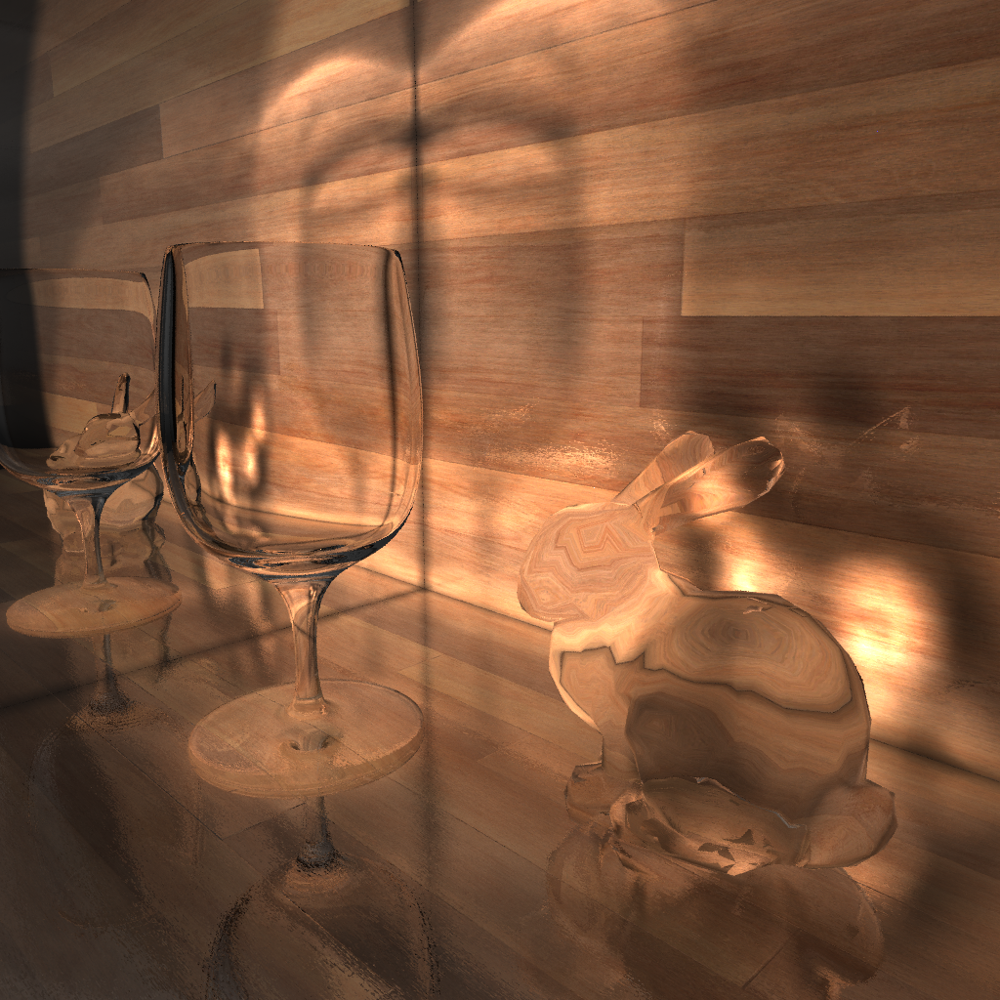
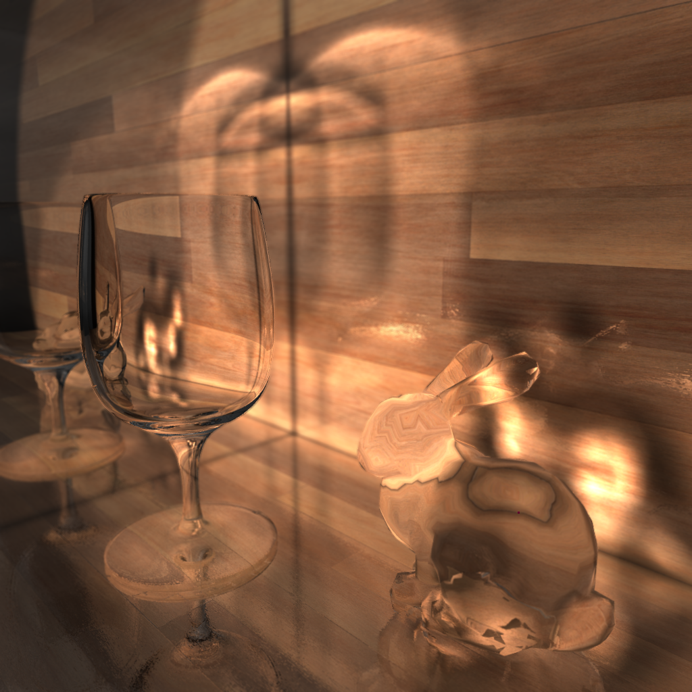
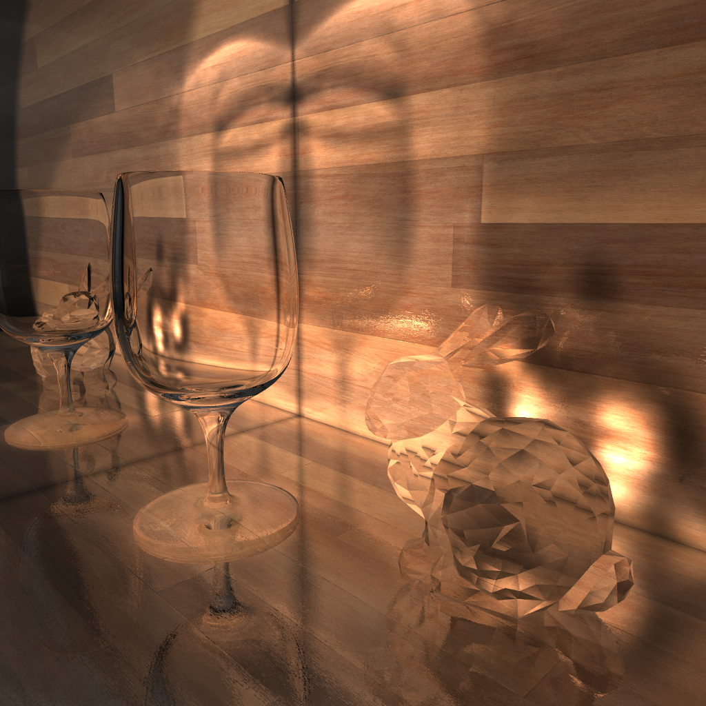

### 光线追踪大作业 实验报告

#### 2020012405 曾云帆

#### 得分项：

- [x] 算法选型：随机渐进式光子映射（SPPM）
- [x] 参数曲面及数值求交
- [x] 复杂网格及法线插值
- [x] 加速算法
- [x] 景深
- [x] 软阴影
- [x] 抗锯齿
- [x] 贴图、凹凸贴图
- [ ] 运动模糊
- [ ] 体积光
- [ ] 体渲染
- [ ] 色散
- [x] 焦散

#### 详细信息：

* **算法选型：**主要位于include/SPPM.hpp的rayTracing()，photonMapping()，radianceEstimate()及其调用的各个函数

  ​	使用了随机渐进式光子映射，每轮先由每个像素点发射一束射线（方向有小幅随机波动，以达到随机采样的目的）并进行折射、反射，得到这一像素所关联的空间中的各个观察点（rayTracing)；然后从光源发出若干光子，经过光子模拟后记录进光子图(photonMapping)；最后遍历每个像素点，依次得到每个观察点的颜色值并进行累加(radianceEstimate)。循环此过程多遍以去除噪点/得到更精准的颜色。

  

  左图为光子图（较亮处光子较多），右图为对应的渲染结果。

  

* **参数曲面及数值求交：**主要位于include/objects/revsurface.hpp

  ​	先将曲面离散化为三角网格，进行简化的求交，若与三角网格有交点则再通过高斯牛顿迭代法求出精确交点。其中高斯牛顿迭代的初值设为三角网格中相交的三角形的三个顶点的重心。

  

  

* **复杂网格及法线插值：**主要位于include/objects/mesh.hpp与triangle.hpp

  ​	复杂网格的求交即为其内部各个三角形分别求交，法线插值则为首先计算每个顶点的法向（由其相邻的几个面的法向平均得到），然后再由三角形的插值算法得到三角形上任意点的法向。（例子可见后）

* **加速算法：**主要位于include/SPPM.hpp的buildBSP()、include/objects/mesh.hpp的buildBSP()

  ​	主要使用了空间kd树（BSP树），来加速光子图的查询，以及三角网格的求交加速。同时使用了openMP来进行并行计算。

* **景深：**主要位于include/SPPM.hpp的pixelPaint()

  ​	使用后处理景深，在每次由像素点发射射线时，记录首个与场景相交的位置，以此为该像素点的深度。在进行最终渲染前根据像素点深度进行不同程度的模糊。（例子可见后）

* **软阴影：**SPPM算法可以自动得到软阴影，光子较少的地方即为阴影处。

* **抗锯齿：**主要位于include/SPPM.hpp的pixelSubdivide()

  ​	使用了超采样抗锯齿，在每轮绘图完成后检查每个像素和其周围像素的颜色差异，差异过大的像素会被细分为四个小像素（这四个像素将原像素均分），这四个像素可以继续被细分（如果下一轮发现这四个像素颜色差异依然过大的话），以此加强颜色变化频率较高处的采样。像素因此被存储为树状结构，树节点结构为Pixel_node。

  

  左图为SPPM渲染2轮后的结果，可以看到杯子中间有较多噪点，右图为对应的像素细分超采样图，细分层数越多颜色越深。

* **贴图：**主要位于include/objects/square.hpp以及include/material.hpp的shade()

  ​	实现了长方形平面的贴图及法向贴图，在平面求交时会同时将u/v坐标传入hit中，在material计算颜色时便会从纹理贴图中取对应位置作为该点的漫反射颜色。法线贴图则是在平面求交时便根据material中存放的法线贴图返回对应的法线方向。

* **焦散：**SPPM算法可以自动得到焦散，光子模拟在经过折射体后便会进行一定程度的聚焦或发散，在光子密度上会有所体现。

#### 渲染结果：

SPPM 4轮 1024*1024 ，左侧墙为一面镜子，地板拥有法向贴图带来凹凸感

SPPM 18轮 1024*1024，另一角度

SPPM 18轮 1024*1024 带景深

SPPM 20轮 1024*1024 无法线插值的兔子

更多样例可见result文件夹。